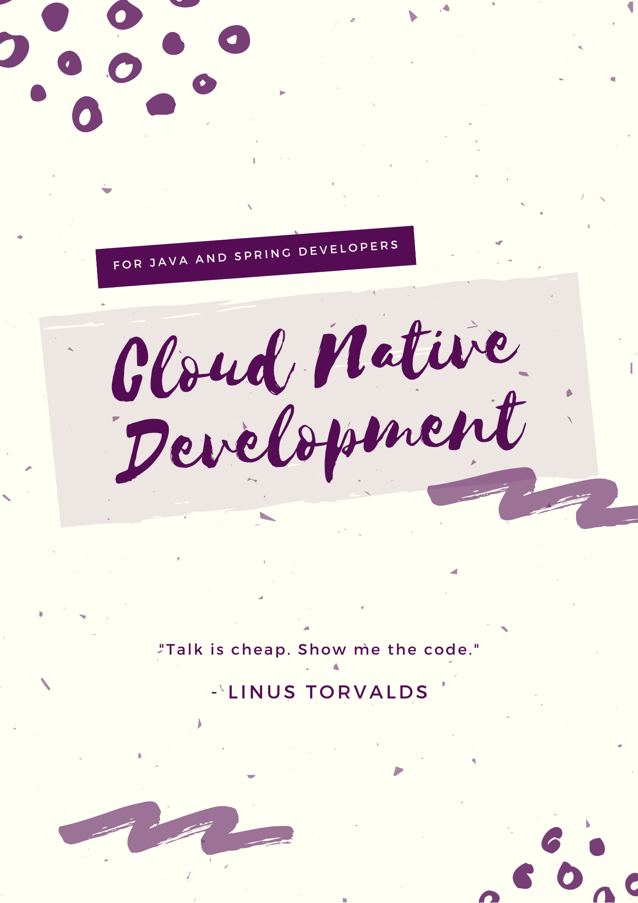

# Cloud Native Development

#### Descriptions:

* This book covers the cloud-native design concepts, definitions, cloud-native patterns, microservices, cloud function, testing, pipeline workflows and best practices for "Cloud-Native".
* Book provides complete real world example that build Cloud-Native application. Also, explains best practices deploying them into different cloud platforms.
* Book mostly focuses on best practices for real time projects rather than theoretical concepts for Cloud-Native application, Testing and CI/CD pipelines.

